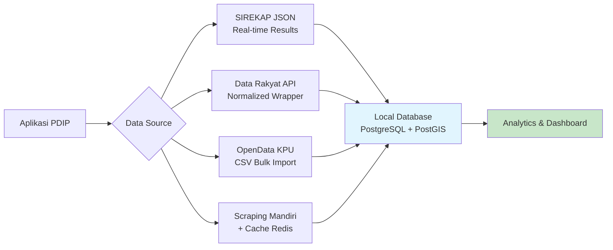

## 📊 Jawaban Lengkap: API Data Pemilu KPU Indonesia

**✅ Singkatnya:** KPU **tidak menyediakan API publik resmi yang terdokumentasi secara formal** untuk data pemilu historis. Namun, terdapat beberapa **sumber data alternatif** yang dapat digunakan dengan pendekatan teknis tertentu.

---

### 🔍 STATUS RESMI API KPU

| Sumber | Status | Keterangan |
|--------|--------|------------|
| **opendata.kpu.go.id** | 📦 Dataset Download | Portal open data KPU menyediakan **151 dataset** untuk diunduh dalam format CSV/Excel, tapi **tidak ada endpoint API REST** [[22]] |
| **sirekap-obj-data.kpu.go.id** | 🌐 JSON Endpoint (Unofficial) | Endpoint JSON yang digunakan Sirekap Pemilu 2024, dapat diakses publik tanpa auth, tapi **tidak ada dokumentasi resmi** [[51]] |
| **infopemilu.kpu.go.id** | 🌐 Web Portal | Portal informasi calon & hasil pemilu, data dapat diakses via scraping/API reverse-engineering [[59]] |
| **pilkada2024.kpu.go.id** | 🌐 Web Portal Pilkada | Sumber data Pilkada, juga tanpa API resmi [[8]] |

---

### 🛠️ SUMBER DATA ALTERNATIF YANG DAPAT DIGUNAKAN

#### 1. **SIREKAP JSON Endpoint** (Pemilu 2024)
```http
# Contoh endpoint wilayah & hasil suara
GET https://sirekap-obj-data.kpu.go.id/wilayah/pemilu/ppwp/0.json
GET https://sirekap-obj-data.kpu.go.id/pemilu/ppwp/3304.json

# Struktur response
{
  "kode_wilayah": "3304",
  "nama": "Kab. Banjarnegara",
  "suara": { ... },
  "persentase": 98.5,
  "status": "PROCESSED"
}
```
> ⚠️ Endpoint ini **tidak terdokumentasi resmi**, struktur bisa berubah sewaktu-waktu. Gunakan dengan rate limit ≤2 req/detik [[51]].

#### 2. **Data Rakyat API** (Wrapper Open Source)
```http
GET https://api.datarakyat.id/kpu/candidate/{id}
GET https://api.datarakyat.id/kpu/results/{region_code}?election_type=pdpr
```
- Proyek komunitas yang menormalisasi data KPU [[55]]
- License: MIT, bisa di-self-host
- Mendukung: profil calon, hasil SIREKAP, data SILON (keuangan kampanye)

#### 3. **Pemilu API GitHub** (Community Project)
- Repository: https://github.com/pemiluapi
- Menyediakan endpoint untuk data Pemilu 2014, Pilkada 2015, dll [[67]]
- ⚠️ Beberapa endpoint sudah tidak aktif, perlu verifikasi ulang

#### 4. **Scraping + Caching Mandiri**
```python
# Contoh sederhana dengan requests + cache
import requests
from datetime import datetime, timedelta

def fetch_kpu_results(region_code: str, election_type: str):
    url = f"https://sirekap-obj-data.kpu.go.id/pemilu/{election_type}/{region_code}.json"
    # Tambahkan cache logic di sini
    return requests.get(url, timeout=30).json()
```

---

### 📋 JENIS DATA YANG TERSEDIA (2024)

| Kategori | Sumber | Format | Cakupan |
|----------|--------|--------|---------|
| 🗳️ Hasil Suara Real-time | SIREKAP | JSON | Nasional → TPS |
| 👤 Profil Calon | infopemilu.kpu.go.id | HTML/JSON | Caleg DPR/DPD/DPRD, Capres-Cawapres |
| 💰 Keuangan Kampanye | SILON via infopemilu | HTML/JSON | Laporan dana kampanye caleg |
| 🗺️ Data Wilayah & Dapil | opendata.kpu.go.id | CSV/Excel | Kode wilayah, alokasi kursi |
| 📊 Statistik Pemilih | opendata.kpu.go.id | CSV/Excel | DPT, partisipasi, disabilitas |
| 📄 Dokumen C1/Formulir | SIREKAP | PDF/Image | Rekapitulasi per TPS |

---

### ⚖️ PERTIMBANGAN HUKUM & ETIKA

1. **UU PDP No. 27/2022**: Hindari mengolah data pribadi pemilih (NIK, alamat lengkap) tanpa dasar hukum [[26]]
2. **Hak Cipta KPU**: Data pemilu adalah **informasi publik**, tapi penyajian ulang harus mencantumkan sumber resmi
3. **Rate Limiting**: Jangan overload server KPU; gunakan cache & batch request
4. **Disclaimer**: Selalu cantumkan *"Data bersumber dari KPU RI, verifikasi ke situs resmi untuk keakuratan"*

---

### 🚀 REKOMENDASI IMPLEMENTASI UNTUK APLIKASI PDIP BANJARNEGARA



#### Strategi Hybrid:
1. **Real-time**: Gunakan SIREKAP endpoint untuk monitoring hasil pemilu terkini
2. **Historis**: Import dataset CSV dari opendata.kpu.go.id ke database lokal
3. **Fallback**: Implementasi scraping terkontrol + cache 24 jam untuk data yang tidak tersedia via API
4. **Compliance**: Tambahkan layer anonymization untuk data sensitif sebelum ditampilkan ke user

---

### 🔧 CONTOH INTEGRASI (Next.js Route Handler)

```typescript
// app/api/kpu/results/route.ts
import { NextResponse } from 'next/server'
import { cache } from 'react'

const SIREKAP_BASE = 'https://sirekap-obj-data.kpu.go.id/pemilu'

export const GET = cache(async (req: Request) => {
  const { searchParams } = new URL(req.url)
  const region = searchParams.get('region') // e.g., "3304" = Banjarnegara
  const type = searchParams.get('type') || 'ppwp'
  
  try {
    const res = await fetch(`${SIREKAP_BASE}/${type}/${region}.json`, {
      next: { revalidate: 300 } // Cache 5 menit
    })
    
    if (!res.ok) throw new Error('KPU API unavailable')
    
    const data = await res.json()
    return NextResponse.json({
      success: true,
      data: {
        region: data.nama,
        votes: data.suara,
        percentage: data.persentase,
        lastUpdate: data.waktu
      },
      source: 'sirekap-obj-data.kpu.go.id',
      disclaimer: 'Data resmi KPU RI. Verifikasi ke kpu.go.id untuk keakuratan.'
    })
  } catch (error) {
    return NextResponse.json(
      { success: false, error: 'Failed to fetch KPU data' },
      { status: 503 }
    )
  }
})
```

---

### ✅ KESIMPULAN

| Pertanyaan | Jawaban |
|------------|---------|
| **Ada API resmi KPU?** | ❌ Tidak ada API REST terdokumentasi resmi |
| **Bisa akses data pemilu?** | ✅ Ya, via JSON endpoint SIREKAP, portal open data, atau wrapper komunitas |
| **Aman untuk produksi?** | ⚠️ Bisa, dengan strategi caching, rate limiting, dan fallback mechanism |
| **Legal?** | ✅ Ya, selama mencantumkan sumber & tidak menyalahgunakan data pribadi |


