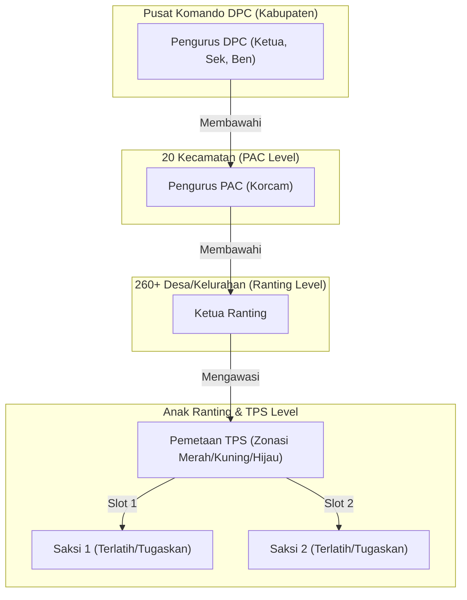

# LAPORAN PENGEMBANGAN APLIKASI
## SISTRA (SISTEM MANAJEMEN SAKSI & KADERISASI) PDI PERJUANGAN KABUPATEN BANJARNEGARA

> [!NOTE]
> Laporan ini disusun secara resmi untuk mendokumentasikan pencapaian, fitur-fitur baru, penyelarasan wilayah geografis, integrasi bagan keanggotaan interaktif, dan kalkulator simulasi Sainte-Laguë pada aplikasi SISTRA PDI Perjuangan Kabupaten Banjarnegara.

---

## 1. PENDAHULUAN & TUJUAN UTAMA
Aplikasi **SISTRA PDI Perjuangan Kabupaten Banjarnegara** dirancang untuk menjadi pusat komando taktis DPC dalam menghadapi Pemilu legislatif dan eksekutif. Fokus utama pengembangan fase ini adalah memastikan kesiapan **100% TPS Memiliki Saksi (2 Saksi Terlatih per TPS)** serta memetakan seluruh kekuatan kader partai dari tingkat Kabupaten hingga ke tingkat TPS terkecil di **20 Kecamatan**.

---

## 2. PETA ARSITEKTUR & INTEGRASI SISTEM
Berikut adalah peta relasi data dan integrasi fitur taktis yang telah diselesaikan:

---

## 3. FITUR-FITUR UNGGULAN YANG DIIMPLEMENTASIKAN

### A. Bagan Organisasi Interaktif & Zoomable (Organigram Dinamis)
* **Kanvas Luas dengan Pan & Zoom**: Fitur bagan keanggotaan kini menggunakan kanvas interaktif yang bisa digeser (*drag-and-pan*) dan di-zoom secara visual dengan kontrol intuitif (`Zoom In`, `Zoom Out`, `Reset`).
* **Dropdown Tingkat Kepengurusan**:
  * **🏛️ Struktur DPC**: Visualisasi dari Ketua DPC, Sekretaris, Bendahara, mengalir ke **20 PAC Kecamatan**, hingga ke **3 Ranting utama**.
  * **📍 Struktur PAC per Kecamatan**: Membuka diagram komprehensif PAC dari Ketua PAC, Sekretaris, Bendahara, mengalir ke **seluruh Desa (Ranting)**, hingga ke **seluruh TPS (Anak Ranting)** di kecamatan tersebut.
* **Integrasi Slot Saksi**: Menampilkan secara transparan slot saksi yang masih kosong (warna abu-abu garis putus-putus) dengan tombol jalan pintas **"Tugaskan Saksi"** untuk mempercepat penempatan saksi.
* **Laci Detail Profil (Profile Drawer)**: Mengeklik pengurus akan menampilkan laci informasi dari kanan yang menampilkan nama, KTA, wilayah tugas, tanggal bergabung, serta tombol pintas WhatsApp untuk langsung menghubungi pengurus tersebut.

### B. Dasbor Penempatan Saksi 100%
* **Satu Kecamatan Dua Saksi per TPS**: Sistem memetakan baris demi baris seluruh TPS di 20 Kecamatan.
* **Deteksi Cepat**: Jika ada slot saksi yang belum diisi, sistem memberi tanda warna merah muda/pink lembut agar admin DPC dapat langsung mendeteksi titik kerawanan saksi.
* **Zonasi Kerawanan**: Setiap TPS dibekali indikator zona (Merah, Kuning, Hijau) berdasarkan riwayat perolehan suara pemilu sebelumnya.

### C. Standardisasi 20 Wilayah Geografis
* **Akurasi 100%**: Menghilangkan ketergantungan filter dinamis dari data seadanya menjadi list statis penuh yang mencakup **20 kecamatan lengkap** se-Banjarnegara.
* **Clean Data**: Memperbaiki kekeliruan data desa bawaan (seperti mengoreksi "Krangandipan" menjadi "Krandegan" dan "Semampir" menjadi "Semarang") secara otomatis baik di database MySQL (Backend) maupun di LocalStorage pengguna (Frontend).
* **Seeding Database**: Menyediakan 40 data TPS taktis (2 TPS per kecamatan untuk seluruh 20 kecamatan) lengkap dengan koordinat GIS riil.

### D. Kalkulator Taktis Sainte-Laguë 2029 (Metode Pembagian Kursi DPRD)
* **Kalkulasi Kursi Otomatis (Divisor Ganjil)**: Menghitung alokasi kursi legislatif DPRD Kabupaten Banjarnegara secara dinamis menggunakan pembagi resmi bilangan ganjil 1, 3, 5, 7, dan 9.
* **Pembagian Kursi Berdasarkan 6 Dapil Resmi Banjarnegara**:
  * **Dapil 1**: 10 Kursi (Kecamatan Banjarnegara, Banjarmangu, Sigaluh)
  * **Dapil 2**: 9 Kursi (Kecamatan Karangkobar, Wanayasa, Kalibening, Pandanarum)
  * **Dapil 3**: 9 Kursi (Kecamatan Batur, Pejawaran, Pagentan)
  * **Dapil 4**: 9 Kursi (Kecamatan Wanadadi, Rakit, Punggelan)
  * **Dapil 5**: 7 Kursi (Kecamatan Purwareja Klampok, Mandiraja, Purwanegara)
  * **Dapil 6**: 6 Kursi (Kecamatan Bawang, Pagedongan, Susukan)
* **Real-time Zero-Sum Target Balancing**: Fitur cerdas simulasi di mana saat tim taktis menguji skenario menurunkan suara target partai pesaing (misal PKB, Golkar, atau Demokrat), selisih suara tersebut **otomatis ditambahkan/dialokasikan langsung ke PDI Perjuangan**. Ini memberikan visualisasi instan berapa suara yang perlu "direbut" untuk memindahkan perolehan kursi ke PDI Perjuangan!
* **Urutan Alokasi Kursi Konseptual**: Menampilkan daftar urutan perolehan kursi ke-1 hingga kursi terakhir beserta nilai bagi (*quotient*) dan partai pemenang untuk mempermudah BAPILU memetakan sisa suara krusial.
* **Pengurutan Data Fleksibel**: Menyediakan opsi pengurutan data berdasarkan suara terbanyak, perolehan kursi terbanyak, hingga urutan standar nomor urut partai politik nasional.

---

## 4. TEKNOLOGI & INFRASTRUKTUR TEKNIS
* **Frontend**: React 18, TypeScript, TailwindCSS/Vanilla CSS, Lucide Icons, Leaflet GIS Maps.
* **State Management & Auto-Migration**: Logika `useEffect` cerdas untuk mendeteksi database lama di LocalStorage pengguna dan meng-upgradenya secara otomatis tanpa mengganggu pengalaman pengguna.
* **Backend**: Node.js + Express, MySQL Database dengan skrip auto-migration otomatis pada startup.

---

## 5. DISTRIBUSI KODE & STATUS DEPLOYMENT
* **Versi Terakhir**: `main` branch di GitHub.
* **Repository**: [diskonnekted/pdip-banjarnegara](https://github.com/diskonnekted/pdip-banjarnegara)
* **Status Build**: **100% SUKSES TERKOMPILASI** tanpa error.
* **Git Status**: Semua perubahan kode telah di-stage, di-commit, dan berhasil di-push ke remote repository pada branch `main`.

---

> **solid bergerak, solid berjuang, solid menang!**
> PDI Perjuangan Kabupaten Banjarnegara ✊ MERDEKA!
